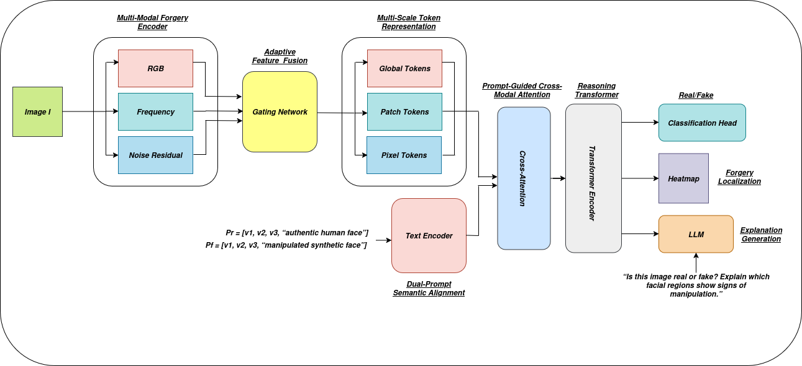
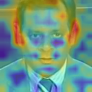
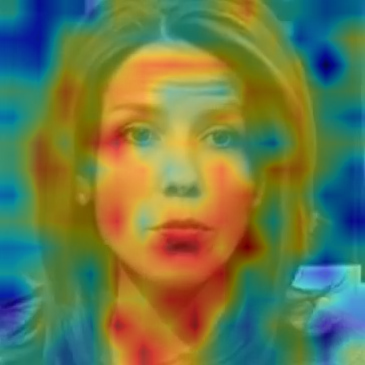
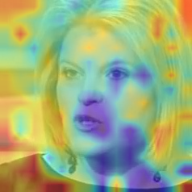
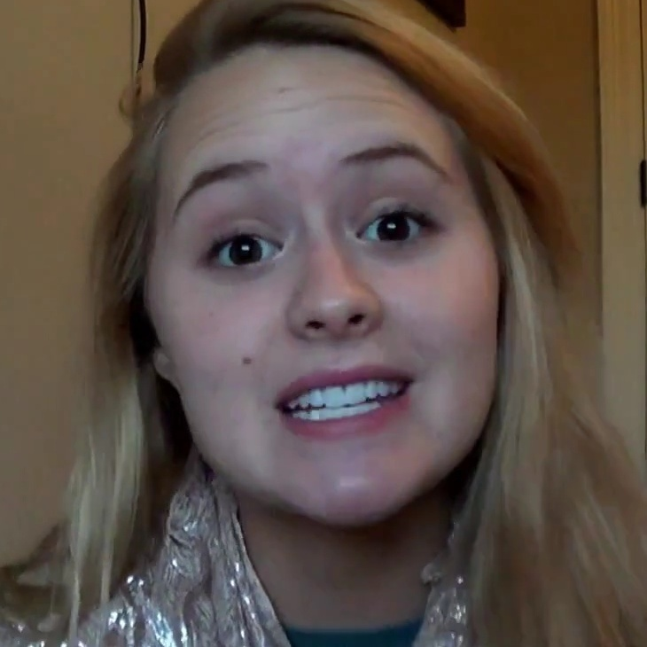
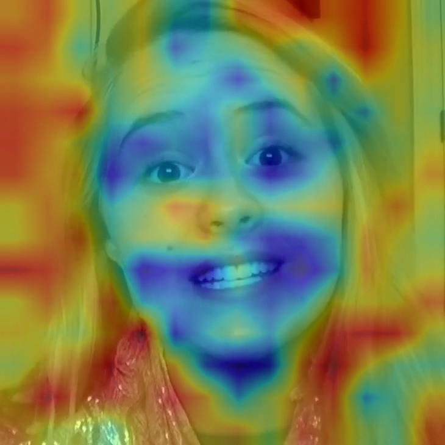

<div align="center">

# Multimodal Face Forgery Detection with Weak Localization and Evidence-Guided Explanations

**Authors:** Shivani (`P25DS002`) and Pankaj Kashyap (`P25CS501`)  
**Program:** Ph.D.  
**Course:** Deep Learning for Computer Vision

A multimodal deepfake face detection framework that combines **RGB semantic features**, **wavelet frequency cues**, and **SRM-based noise residuals** for **real/fake classification**, **weak localization**, and **evidence-guided explanations**.

</div>

---

## Overview

Deepfake face manipulation has become increasingly realistic, making reliable and interpretable forgery detection an important research problem. This repository contains our complete project on multimodal face forgery detection using:

- **RGB branch** for semantic facial structure
- **Wavelet branch** for frequency-domain artifacts
- **SRM branch** for residual-noise inconsistencies
- **Gated fusion** for adaptive multimodal integration
- **Prompt-guided bridge** for representation refinement
- **Weak localization head** for evidence-region visualization
- **Evidence-guided explanation pipeline** for short detector-consistent explanations

The best final detector was obtained using the **no-reasoning** configuration, where the reasoning transformer was removed after ablation.

---

## Highlights

- Multimodal forensic cues improve deepfake detection performance.
- Weak localization provides interpretable evidence regions on manipulated faces.
- An evidence-guided language module generates short model-consistent explanations.
- Multi-source training improves transfer to harder cross-dataset settings.
- The strongest final detector in this project is the **no-reasoning** variant.

---

## Architecture

<p align="center">
  
</p>

**Figure:** Overall architecture of the proposed multimodal face forgery detection framework. The system combines RGB semantic features, wavelet frequency features, and SRM-based residual features through gated fusion and multi-scale token construction. The fused representation is refined using a prompt-guided bridge and used for classification and weak localization. The explanation module generates a short evidence-guided natural-language rationale based on detector output and localized facial evidence.

---

## Main Results

### Final FF++ Detector

| Metric | Value |
|---|---:|
| Accuracy | 0.9188 |
| F1-score | 0.9368 |
| Precision | 0.9284 |
| Recall | 0.9453 |
| AUC | 0.9720 |
| EER | 0.0822 |

### Key Findings

- Multimodal forensic cues contribute positively to deepfake detection.
- The **wavelet branch**, **SRM branch**, and **contrastive supervision** all provide measurable gains.
- The best final detector is obtained **without the reasoning transformer**.
- Cross-dataset generalization remains challenging, but **multi-source training on FF++ + Celeb-DF** improves DFDC transfer.

---

## Ablation Study

| Variant | Accuracy | F1 | AUC | EER |
|---|---:|---:|---:|---:|
| Full model | 0.8944 | 0.9119 | 0.9689 | 0.0891 |
| No SRM | 0.8959 | 0.9198 | 0.9571 | 0.1034 |
| No wavelet | 0.9017 | 0.9216 | 0.9619 | 0.1011 |
| No wavelet + no SRM | 0.8975 | 0.9196 | 0.9583 | 0.1104 |
| No bridge | 0.9133 | 0.9306 | 0.9690 | 0.0864 |
| No contrastive | 0.8946 | 0.9149 | 0.9588 | 0.1034 |
| **No reasoning** | **0.9207** | **0.9377** | **0.9715** | **0.0822** |

---

## Cross-Dataset Generalization

| Training Source | Test Target | AUC | EER |
|---|---|---:|---:|
| FF++ | FF++ | 0.9720 | 0.0822 |
| FF++ | Celeb-DF | 0.7852 | 0.2657 |
| FF++ | DFDC | 0.6349 | 0.4114 |
| Celeb-DF | Celeb-DF | 1.0000 | 0.0000 |
| Celeb-DF | FF++ | 0.6392 | 0.4036 |
| Celeb-DF | DFDC | 0.6367 | 0.3954 |
| **FF++ + Celeb-DF** | **DFDC** | **0.6941** | **0.3644** |
| FF++ + Celeb-DF + DFF | DFDC | 0.6945 | 0.3654 |
| FF++ + Celeb-DF + DG-Aug | DFDC | 0.6609 | 0.3943 |

---

## Qualitative Examples

### Fake Example 1

<table>
<tr>
<td align="center"><br><b>Original</b></td>
<td align="center"><br><b>Heatmap Overlay</b></td>
</tr>
</table>

**Prediction:** FAKE  
**Confidence:** 99.71%  
**Fake Probability:** 0.9971  
**Explanation:** The image is predicted as fake because the highlighted region around the forehead and eyes shows suspicious local inconsistencies that may indicate manipulation. The model confidence is high.

### Fake Example 2

<table>
<tr>
<td align="center"><br><b>Original</b></td>
<td align="center"><br><b>Heatmap Overlay</b></td>
</tr>
</table>

**Prediction:** FAKE  
**Confidence:** 99.81%  
**Fake Probability:** 0.9981  
**Explanation:** The image is predicted as fake because the highlighted region around the mouth and chin shows suspicious local inconsistencies that may indicate manipulation. The model confidence is high.

### Real Example 1

<table>
<tr>
<td align="center"><br><b>Original</b></td>
<td align="center"><br><b>Heatmap Overlay</b></td>
</tr>
</table>

**Prediction:** REAL  
**Confidence:** 99.22%  
**Fake Probability:** 0.0078  
**Explanation:** The image is predicted as real because the highlighted facial region appears visually consistent and does not show strong manipulation evidence. The model confidence is high.

### Real Example 2

<table>
<tr>
<td align="center"><br><b>Original</b></td>
<td align="center"><br><b>Heatmap Overlay</b></td>
</tr>
</table>

**Prediction:** REAL  
**Confidence:** 99.51%  
**Fake Probability:** 0.0049  
**Explanation:** The image is predicted as real because the highlighted facial region appears visually consistent and does not show strong manipulation evidence. The model confidence is high.

---


### Installation

Clone the repository and install the required dependencies.

```bash
git clone <your-repo-url>
cd Deepfake-Detector-Submission
pip install -r requirements.txt
```

### Environment Notes

- Use the Python version supported by your project dependencies.
- Install all required packages from `requirements.txt`.
- Update dataset paths inside the config files before training or evaluation.
- Keep pretrained checkpoints inside `checkpoints/` if required by your setup.

---

## Datasets

This project was developed using:

- **FaceForensics++ (FF++)**
- **Celeb-DF-v1**
- **DFDC**
- **DeepFakeFace** for auxiliary experiments

Prepare extracted face crops and organize dataset paths through the configuration files in `configs/`.

---

## Training

This project supports both single-source and multi-source training setups.

### 1. Train the main FF++ detector

```bash
python train.py --config-name train_stage1 stage=1
```

### 2. Train the multi-source FF++ + Celeb-DF detector

```bash
python train.py --config-name train_multisource_ffpp_celebdf_stage1 stage=1
```

### 3. Train the multi-source FF++ + Celeb-DF + DeepFakeFace detector

```bash
python train.py --config-name train_multisource_ffpp_celebdf_dff_stage1 stage=1
```

### Training Output

Training typically saves:

- model checkpoints in `checkpoints/`
- logs in `logs/`
- result summaries in `results/`

---

## Threshold Search

After training, perform threshold selection on the validation split to find the best decision threshold.

### FF++ + Celeb-DF model

```bash
python scripts/threshold_search_multisource.py \
  --config configs/train_multisource_ffpp_celebdf_stage1.yaml \
  --ckpt checkpoints/stage1_final_detector_multisource_ffpp_celebdf.pth \
  --split val \
  --batch_size 32 \
  --num_workers 0 \
  --out_dir results/threshold_search_multisource
```

### FF++ + Celeb-DF + DFF model

```bash
python scripts/threshold_search_multisource_dff.py \
  --config configs/train_multisource_ffpp_celebdf_dff_stage1.yaml \
  --ckpt checkpoints/stage1_final_detector_multisource_ffpp_celebdf_dff.pth \
  --split val \
  --batch_size 32 \
  --num_workers 0 \
  --out_dir results/threshold_search_multisource_dff
```

### Output

Threshold search stores results in the specified output directory, including the selected threshold and evaluation summary.

---

## Evaluation

Evaluate trained models on cross-dataset benchmarks such as Celeb-DF and DFDC.

### Evaluate on Celeb-DF

```bash
python scripts/evaluate_celebdf_video.py \
  --data_root /path/to/Celeb-DF-v1 \
  --config configs/train_stage1.yaml \
  --ckpt checkpoints/stage1_final_detector_no_reasoning.pth \
  --threshold 0.29 \
  --batch_size 32 \
  --num_workers 0 \
  --agg mean \
  --out_dir results/celebdf_eval
```

### Evaluate on DFDC

```bash
python scripts/evaluate_dfdc_video.py \
  --frames_root /path/to/DFDC/test/frames \
  --labels_path /path/to/DFDC/test/metadata.json \
  --config configs/train_multisource_ffpp_celebdf_stage1.yaml \
  --ckpt checkpoints/stage1_final_detector_multisource_ffpp_celebdf.pth \
  --threshold 0.62 \
  --batch_size 32 \
  --num_workers 0 \
  --agg mean \
  --out_dir results/dfdc_eval
```

### Evaluation Output

Evaluation scripts typically report:

- Accuracy
- Precision
- Recall
- F1-score
- AUC
- EER

and save prediction results in the selected output directory.

---

## Inference

Run inference on a single image for classification, localization, and explanation generation.

### 1. Detector + weak localization

```bash
python scripts/inference_localizer_final.py /path/to/image.jpg \
  --config configs/train_stage1.yaml \
  --ckpt checkpoints/stage1_final_detector_no_reasoning.pth \
  --threshold 0.29 \
  --output figures/localization/result.png
```

### 2. Detector + localization + explanation

```bash
python scripts/inference_explanation_final.py /path/to/image.jpg \
  --config configs/train_stage1.yaml \
  --ckpt checkpoints/stage1_final_detector_no_reasoning.pth \
  --threshold 0.29 \
  --llm_model TinyLlama/TinyLlama-1.1B-Chat-v1.0 \
  --output results/explanations/result.png
```

### 3. Generate final report examples

```bash
python scripts/generate_report_examples.py \
  --config configs/train_stage1.yaml \
  --ckpt checkpoints/stage1_final_detector_no_reasoning.pth \
  --threshold 0.29 \
  --llm_model TinyLlama/TinyLlama-1.1B-Chat-v1.0 \
  --output_root results/report_examples \
  --images /path/to/fake1.jpg /path/to/fake2.jpg /path/to/real1.jpg /path/to/real2.jpg \
  --names fake_example_1 fake_example_2 real_example_1 real_example_2
```

### Inference Output

Inference can produce:

- predicted label (`REAL` / `FAKE`)
- confidence score
- fake probability
- weak localization heatmap
- short evidence-guided explanation
